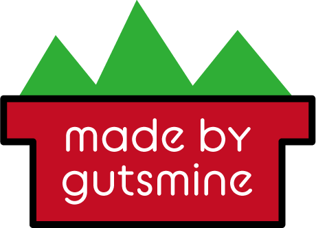

# prof(プロス)


### これは新しいjavascriptのフレームワークです。

-----
## 使い方 

#### このリポジトリをクローンしてください

    git@github.com:gutsmine/pros

#### もしくはnpmで以下のコマンドを実行してください

```
npm install pros
```

#### あなたのプロジェクトに埋め込んでください。

    <script src="pros.js"></script>
### もしくは

    fetch('./pros.js').then(r=>r.text()).then(t=>eval(t))

----

## 構文

### html

    window.document

  #### と同じ形になります。

    var document = html.input.value;

### getid(変数名, 取得する要素のid)

#### idから要素を取得します。

    var 変数名 = document.getElementById(取得するid);
  #### と同じ形になります。

#### getclass、getnameも同様に使えます。

## getidval(変数名, 取得するid)

##### idから要素のテキストを取得します。

```
var 変数名 = document.getElementById(取得するid).value;
```


   ## cli(要素変数, 実行する関数, 引数)

#### 要素をクリック処理できるようにします。

    要素変数.onclick(function(引数){実行する関数}
   #### と同じ形になります。 

   ##### また、引数は、変数で複数指定可能にする予定です。

   ## che(要素変数, 実行する関数, 引数)

#### 要素が変更されたら処理できるようにします。

    要素変数.addEventlistener("chenge",(event)=>{
    関数名(引数)
    })
   #### と同じ形になります。

   ## kup(要素変数, 関数名, 引数)

#### 要素内でキーボードが押されたら処理できるようにします。

    要素変数.addEventlistener("keyup",(event)=>{
    if(event.isComposing){
    関数名(引数)
    }
    })  
   #### と同じ形になります。

   ## inhtm(要素変数, テキスト)

#### 要素のテキストを変更します。

    要素変数.innerHTML=テキスト;
   #### と同じ形になります。

## newobj(変数名, 追加するテキスト)

新しいオブジェクト変数を作成します。

```
var 変数名 = {追加するテキスト};
```

#### と同じ形になります。

## addobj(変数名, 追加するテキスト)

#### オブジェクト変数に追加します。

```
変数名.push(追加するテキスト);
```

#### と同じ形になります。

#### newlistやaddlistもあります。

## mergevar(追加する変数名, 変数1, 変数2)

#### 変数を統合します。

```
var 追加する変数名 = 変数1 +  変数2;
```

#### と同じ形になります。

-----
   ### 現在の開発途中のため、不具合が発生する場合があります。

 このリポジトリはMIT LICENSE (本ライセンス)に基づいてライセンスされます。あなたがこのファイルを使用するためには、本ライセンスに従わなければなりません。本ライセンスのコピーは下記の場所から入手できます。

https://github.com/gutsmine/pros/blob/master/LICENSE


