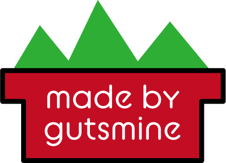

# pros


[](https://packagephobia.now.sh/result?p=pros) 


### This is a new javascript framework.

-----
## usage

#### Please clone this repository

    git@github.com:gutsmine/pros

#### Or run the following command in npm

```
npm install pros
```

#### Embed it in your project.

    <script src="pros.js"></script>
### Or

    var pros = require('pros');

----

## syntax

#### Enter in the form 'pros. (argument)'.

### getid(Variable name, id)

#### Gets an element from id.

    var name = document.getElementById(id);
#### It will be the same shape as

#### You can use getclass and getname in the same way.

## click(Element variable, Function name)

#### Allows click processing of an element.

    Element variable.onclick(function(){Function name(argument)}
#### It will be the same shape as 

#### In addition, we plan to make it possible to specify multiple arguments using variables.

## change(Element variable, The function to execute, argument)

#### Allows processing when an element changes.

    Element variable.addEventlistener("chenge",(event)=>{
    Function name(argument)
    })
#### It will be the same shape as

## keyup(Element variable, Function name, argument)

#### Allows processing when a keyboard is pressed within an element.

    Element variable.addEventlistener("keyup",(event)=>{
    if(event.isComposing){
    Function name(argument)
    }
    })  
#### It will be the same shape as

## inhtml(Element variable, text)

#### Change the text of the element.

    Element variable.innerHTML=text;
   #### It will be the same shape as

## newobj(Variable name, The text to add)

#### Create a new object variable.

```
var Variable name = {The text to add};
```

#### It will be the same shape as

#### There are also newlist.

## addvar(Variable name, The text to add)

#### Append to object variable.

```
Variable name.push(The text to add);
```

#### It will be the same shape as


## mergevar(variable1, variable2)

#### Integrate variables.

```
var Variable name = Variable 1 +  Variable 2;
```

#### It will be the same shape as


## getvalue(element, Acquisition method {id, class and name})

Get the value value of some elements.

```
var Variable name = document.getElementBy〇〇(element);
```


## makeCV(data)

Enable the canvas.

```
var canvas = document.getElementById('canvas');
var ctx = canvas.getcontext('2d');
```


##### Please input as follows for elements that get elements such as getname, getid, getclass, and variables related to addvar, newlist, newobj, margevar.

```
var Variable name = pros.property(argument);
```


-----
   ### Due to the current development process, problems may occur.

 This repository is licensed under MIT LICENSE (this license). You must comply with this license to use this file. A copy of this license can be obtained from:

https://github.com/gutsmine/pros/blob/master/LICENSE


